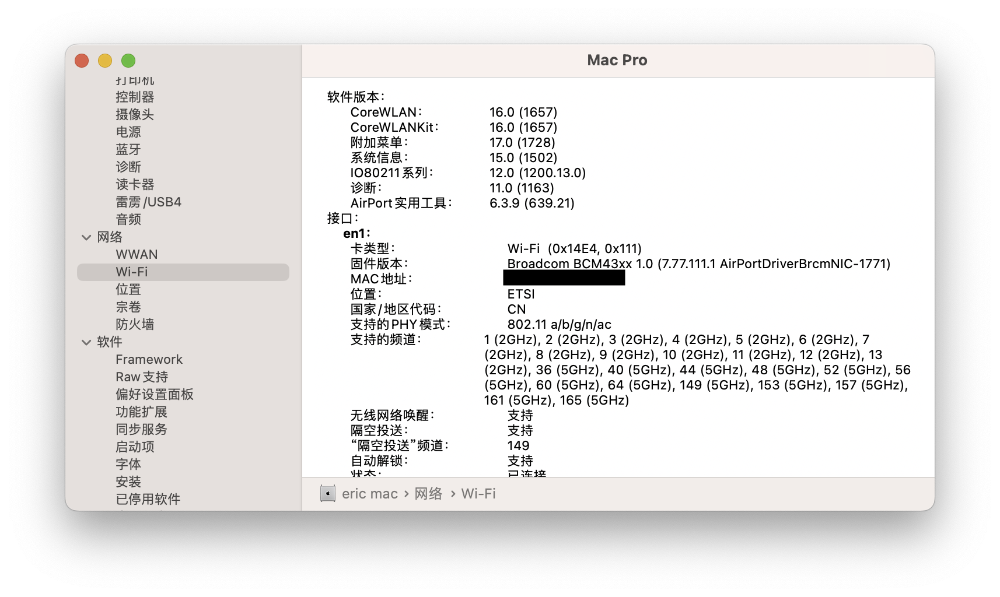
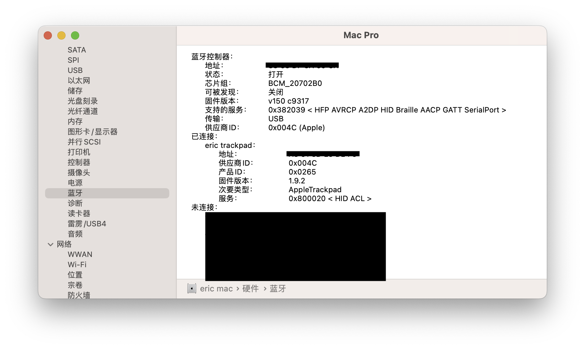
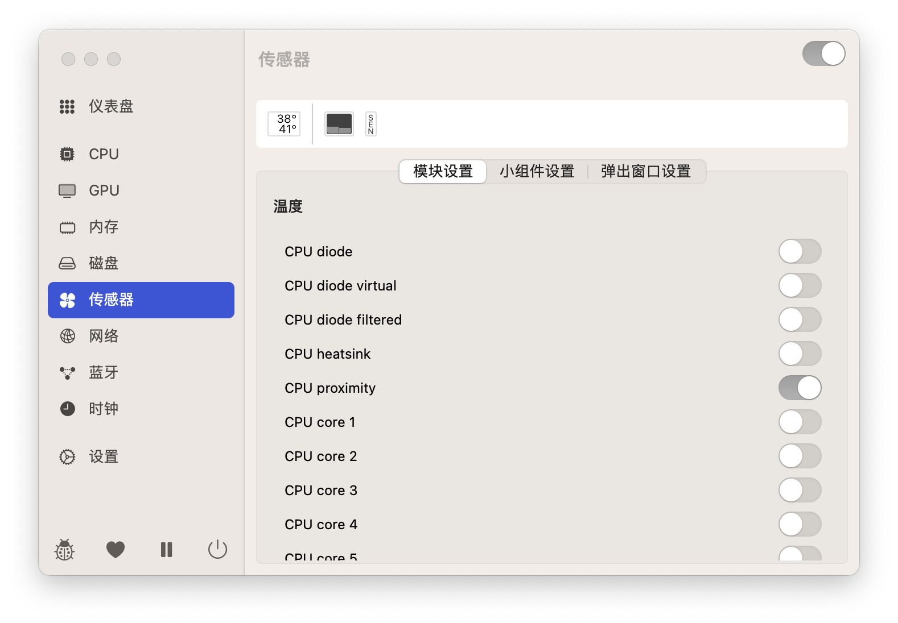

# OpenCore i5-13400F/B760M/RX6600 EFI

## Feature

- OpenCore 0.9.2
- All release version
- [x] 传感器 sensor
    - [x] CPU temperature sensor
        - boot-args 增加 `lilucpu=17` ，覆盖cpu generation。
    - [x] GPU sensor
        - RadeonSensor.Kext
        - SMCRadeonSensor.Kext
- [x] 睿频 turbo boost
- [x] 休眠唤醒
- [x] iService/AirDrop/etc

## Specs

- CPU i5-13400F
- [MS-终结者 B760M D4](https://www.maxsun.com.cn/2023/0104/5870.html) / [MAXSUN Terminator B760M D4](https://www.maxsun.com/products/terminator-b760m-d4)
- RX6600
- Gloway光威 32GB DDR4 3200 台式机内存条 天策系列-皓月白 * 2
- ZHITAI TiPlus5000 1TB
- fenvi FV-T919

## IMG

### wifi && bluetooth

### sensor

# MEMO

- OpenCore的选择器按空格才会展示其他选项。 Some options won't show unless space pressed.

# Reference

- [OpenCore-Install-Guide](https://dortania.github.io/OpenCore-Install-Guide/)
- [luchina-gabriel/BASE-EFI-INTEL-DESKTOP-13THGEN-RAPTOR-LAKE](https://github.com/luchina-gabriel/BASE-EFI-INTEL-DESKTOP-13THGEN-RAPTOR-LAKE)
- [nsinm/13400F-B760M-EFI](https://github.com/nsinm/13400F-B760M-EFI)
